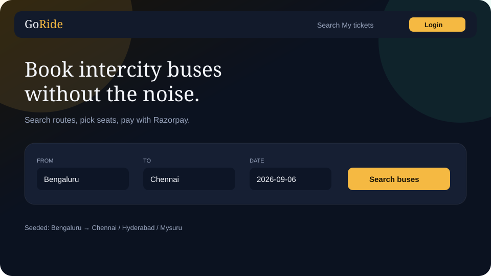
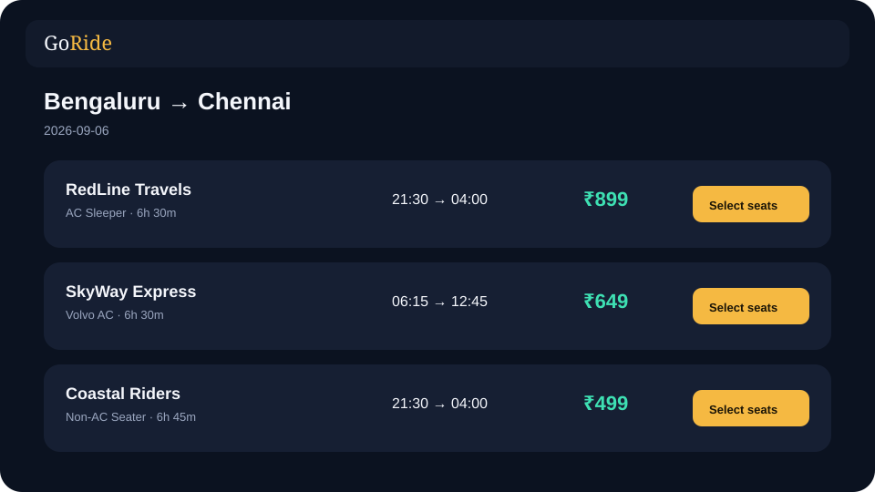
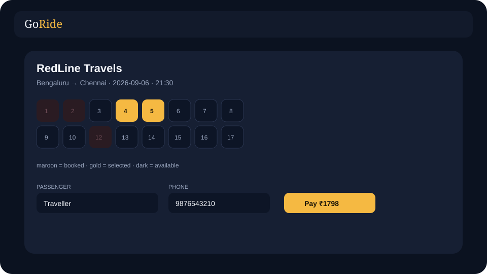

# GoRide — MERN Bus Ticket Booking

Sample full-stack bus booking app (2026 stack):

- **MongoDB** + Mongoose 8
- **Express** REST API + JWT auth
- **React 19** + **Vite 6** + React Router 7
- **Razorpay** Checkout (real keys) or built-in **mock** checkout
- Dark, readable UI

Repo: https://github.com/Manjusri-developer/bus-ticket-booking-mern

---

## How the UI looks

Dark navy canvas, gold buttons, mint-green prices. Fonts: **Instrument Serif** for headings, **DM Sans** for UI text. Cards have soft rounded corners and a faint gold/green glow behind the hero.

| Token | Colour | Used for |
| --- | --- | --- |
| Background | `#0b1220` | Page |
| Card | `#161f33` | Search box, bus rows, seat panel |
| Gold | `#f5b942` | Brand accent, primary buttons, selected seats |
| Mint | `#3ee0b3` | Ticket price |
| Muted | `#9aa6bf` | Labels, times, helper text |
| Booked seat | `#2a1b22` | Already taken |

### Home — search

Sticky top bar: **GoRide** on the left, Search / My tickets / Login on the right. Large serif headline, then one search card: From, To, Date, gold **Search buses** button. Default route is Bengaluru → Chennai.



### Results — bus list

Each bus is a wide card: operator + coach type, departure → arrival, mint price, gold **Select seats**.



### Seat map + pay

8-column seat grid (40 seats). Maroon = booked, gold = your pick, dark = free. Passenger + phone fields, then **Pay ₹…** which opens Razorpay (or a mock confirm if `PAYMENT_MODE=mock`).



### Other screens

- **Login / Register** — centered card (~420px), prefilled demo email `demo@goride.test`.
- **My tickets** — list of confirmed trips with seats, route, amount, Razorpay payment id.
- Layout is one column under ~800px so it stays readable on a phone.

Live UI after `npm run dev` in `frontend`: http://localhost:5173

---

## How it works

```
Browser (Vite :5173)
   → /api/* proxied to Express :5000
        → MongoDB
        → Razorpay (when PAYMENT_MODE=razorpay)
```

1. Search **from / to / date**.
2. Pick seats.
3. Login. Click **Pay**.
4. Frontend calls `POST /api/payments/order` (amount in paise).
5. Razorpay Checkout opens (or a mock confirm dialog if no keys).
6. Frontend sends payment ids + HMAC signature to `POST /api/bookings`.
7. Server verifies the signature, then reserves seats.
8. Ticket appears under **My tickets** with the payment id.

### API map

| Method | Path | Auth | Purpose |
| --- | --- | --- | --- |
| GET | `/api/health` | no | Liveness |
| POST | `/api/auth/register` | no | Create user |
| POST | `/api/auth/login` | no | JWT |
| GET | `/api/buses` | no | Search |
| GET | `/api/buses/:id` | no | Bus + seats |
| GET | `/api/payments/config` | no | `mock` or `razorpay` + public key |
| POST | `/api/payments/order` | JWT | Create Razorpay/mock order |
| POST | `/api/bookings` | JWT | Verify payment + book |
| GET | `/api/bookings/me` | JWT | My tickets |

---

## Run locally

### Prerequisites

- Node.js 20 or 22 LTS
- MongoDB local or Atlas
- Optional: [Razorpay test keys](https://dashboard.razorpay.com/app/keys)

### 1. Clone

```bash
git clone https://github.com/Manjusri-developer/bus-ticket-booking-mern.git
cd bus-ticket-booking-mern
```

### 2. Backend

```bash
cd backend
cp .env.example .env
npm install
npm run seed
npm run dev
```

Default `.env` uses **mock payments** so the app runs with zero Razorpay setup.

To use the real gateway:

```
PAYMENT_MODE=razorpay
RAZORPAY_KEY_ID=rzp_test_xxxx
RAZORPAY_KEY_SECRET=xxxx
```

Restart the API. UI will open official Razorpay Checkout. Test cards are in the Razorpay dashboard docs (success: `4111 1111 1111 1111`).

### 3. Frontend

```bash
cd frontend
npm install
npm run dev
```

http://localhost:5173

---

## Test with Postman

Base: `http://localhost:5000`

### Auth

**POST** `/api/auth/register`

```json
{
  "name": "Demo User",
  "email": "demo@goride.test",
  "password": "secret12"
}
```

Save `token`. Use Bearer Token on the next calls.

### Create order

**POST** `/api/payments/order`

```json
{
  "busId": "PASTE_BUS_ID",
  "seats": [7, 8]
}
```

Response includes `orderId`, `amount` (paise), `mode`.

### Book after mock payment

If `PAYMENT_MODE=mock` (default):

**POST** `/api/bookings`

```json
{
  "busId": "PASTE_BUS_ID",
  "seats": [7, 8],
  "passengerName": "Demo User",
  "passengerPhone": "9876543210",
  "razorpayOrderId": "order_mock_123",
  "razorpayPaymentId": "pay_mock_123",
  "razorpaySignature": "mock_sig_order_mock_123_pay_mock_123"
}
```

Signature format for mock: `mock_sig_<orderId>_<paymentId>`.

Without a valid signature the API returns **402**.

### Real Razorpay (Postman)

1. Create order as above.
2. Pay that `order_id` in Checkout (or Razorpay test tools).
3. Copy `razorpay_payment_id` and `razorpay_signature` from the Checkout success payload.
4. POST `/api/bookings` with those three fields. Server checks HMAC-SHA256 of `orderId|paymentId` with `RAZORPAY_KEY_SECRET`.

---

## Payment files

```
backend/routes/payments.js     create order + public key
backend/utils/payments.js      HMAC verify + mock mode
backend/routes/bookings.js     refuses unpaid bookings
frontend/src/pay.js             Razorpay.js or mock dialog
```
